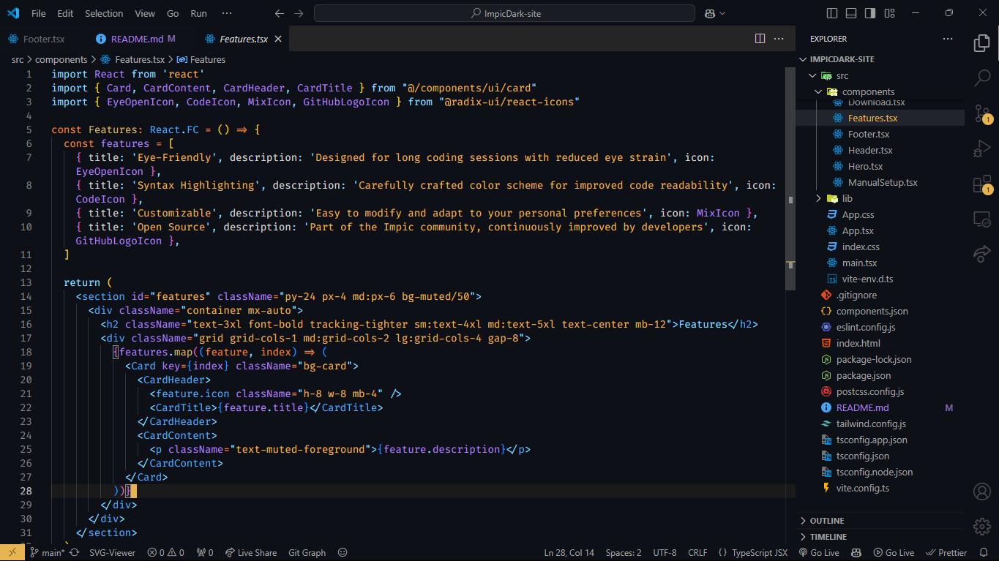

# **Impic Dark - A VS Code Theme for Dark Mode Lovers**

Impic Dark is a personalized and feature-rich dark theme for Visual Studio Code, designed for developers who thrive in dark mode. Created under the name **Impic**, a community founded by **Zaid**, this open-source theme blends aesthetic design and functional syntax highlighting to enhance your coding experience.

---

## **Features**
- 🎨 **Custom Dark Palette**: Designed for dark theme enthusiasts with a sleek and modern aesthetic.
- ✨ **Enhanced Syntax Highlighting**: Carefully crafted to improve code readability and focus.
- 📚 **Consistent UI Elements**: Customized activity bar, status bar, editor tabs, and more.
- 🌐 **Community-Driven**: Open-source and built with feedback from developers in the **Impic** community.

---

## **Preview**
Here’s a sneak peek of the Impic Dark theme:  



---

## **Installation**
### **Option 1: Download Manually**
1. Download the `.vsix` file from the [official Impic Dark website](https://impic-dark.vercel.app).  
2. Open Visual Studio Code and navigate to:  
    `Extensions > ... (three dots menu) > Install from VSIX...`  
3. Select the downloaded `.vsix` file, and the theme will be installed.  
4. Activate the theme:  
    `Ctrl + K, Ctrl + T` → Choose **Impic Dark** from the list.

### **Option 2: Marketplace**
Install directly from the **VS Code Marketplace**: [Impic Dark on Marketplace](https://marketplace.visualstudio.com/items?itemName=zaid-commits.impicdark)

---

## **Customization**
You can further customize your experience by tweaking the following settings in `settings.json`:

```json
{
    "workbench.colorTheme": "Impic Dark",
    "editor.fontFamily": "Fira Code, Consolas, 'Courier New', monospace",
    "editor.fontLigatures": true,
    "editor.cursorBlinking": "smooth"
}
```

---

## **Development**
This theme was built using the following tech stack:
- **Visual Studio Code Theme APIs**: To define color palettes and styles.
- **JSON Configuration**: For defining color tokens and settings.
- **Yo Code**: Used for scaffolding the VS Code extension.
- **VSCE**: To package and prepare the theme for deployment.

---

## **Contributing**
We welcome contributions from the community! If you have ideas or feedback, follow these steps:
1. Fork this repository.
2. Clone it to your machine.
3. Make your changes and submit a pull request.

---

## **Roadmap**
- 🚀 **VS Code Marketplace Release**: The theme will soon be published for direct installation.
- 🌟 **Community Customizations**: Regular updates based on user feedback.
- 📈 **Expanding the Impic Ecosystem**: More developer-focused tools and themes.

---

## **About Impic**
Impic is a developer-focused community led by Zaid, dedicated to creating open-source projects that empower programmers worldwide. To join the community, follow this [Community Link!](https://community.impic.tech).

---

## **License**
This project is licensed under the MIT License. Feel free to use, modify, and distribute it as you like.

---

## **Acknowledgments**
Special thanks to:
- **Impic Community** for feedback and support.
- Everyone contributing to the open-source ecosystem.

---

## **Links**
- 🌐 **Website**: [https://impic-dark.vercel.app](https://impic-dark.vercel.app)
- 📂 **GitHub Repository**: [https://github.com/zaid-commits/impicdark](https://github.com/zaid-commits/impicdark)
- 💬 **Join the Community**: [https://discord.gg/impic](https://discord.gg/impic)

Elevate your coding experience with Impic Dark!